# WageGuard India (वेतन रक्षक)

> **Know your risk. Know your rights.**
> 
> An end-to-end, rigorously benchmarked wage-theft risk engine and grounded statutory rights navigator for India's 500M+ informal and low-wage workforce. Built with a scikit-learn empirical risk model, a retrieval-augmented (RAG) legal assistant grounded in Indian labour law, and a privacy-first, zero-network IndexedDB shift diary with encrypted QR caseworker handoff.

[](https://www.python.org/downloads/)
[](https://fastapi.tiangolo.com/)
[](https://react.dev/)
[](https://vitejs.dev/)
[](https://tailwindcss.com/)
[](https://www.trychroma.com/)
[](https://huggingface.co/sentence-transformers/paraphrase-multilingual-MiniLM-L12-v2)
[](#privacy--local-first-guarantee)
[](LICENSE)

---

## 🔗 Live Demo & Walkthrough

* 🌐 **Live Application**: `[Live Demo URL — To be populated post-deployment]`
* 📹 **Full Product Walkthrough**: `[Demo Video Walkthrough — To be populated post-deployment]`
* 📦 **Repository**: https://github.com/Pawanrudupa/wageguard-India

---

## The Problem Statement

Wage theft — unpaid overtime, sub-minimum wage compensation, illegal deductions, withheld final settlements, and unremitted PF/ESI social security contributions — affects millions of informal, migrant, and gig workers across India. 

Building an engineering solution for Indian labour enforcement presents two fundamental data challenges:

1. **No Centralized Employer Violation Database**: Unlike the United States (which maintains OSHA and WHD enforcement registries), **the Government of India maintains no central, company-level wage violation database**. In repeated official replies to unstarred parliamentary questions in the Lok Sabha and Rajya Sabha, the Ministry of Labour & Employment has affirmed: *"the data is not maintained centrally."* Any system purporting to generate "employer risk scores" relies on fabricated or scraped social media data that carries severe legal liability. The only legally defensible and honest macroscopic approach is **state- and sector-aggregated inspection density modeling**.
2. **Fragmented & Transitional Jurisprudence**: Indian labour law is undergoing its most significant structural overhaul in 75 years. On **21 November 2025**, the **Code on Wages, 2019** was officially notified into force nationwide, repealing and consolidating legacy statutes (Minimum Wages Act 1948, Payment of Wages Act 1936, Payment of Bonus Act 1965, Equal Remuneration Act 1976), introducing a unified **3-year limitation period** (Section 45(6)), shifting the **burden of proof to the employer** (Section 59), and mandating **2-working-day full settlement** upon separation (Section 17(2)). General-purpose LLMs hallucinate outdated statutes, conflate state procedural rules, and misquote wage rates.

### Why ML + RAG (and not either alone)?

WageGuard India decouples statistical risk prediction from statutory legal retrieval into two distinct pipelines:
* **The Risk Engine (ML)** is an empirical classification model trained on 5 years of Ministry of Labour inspection statistics. It answers: *"Statistically, how frequently are wage laws violated in my sector and state?"*
* **The Rights Assistant (RAG)** is a retrieval-grounded semantic engine citing specific statutory sections and official gazette notifications. It answers: *"Statistically and legally, is what my employer did lawful, and what section protects me?"*

---

## System Architecture

```mermaid
flowchart TB
    subgraph Client["Frontend Client (React + TypeScript + Neo-Brutalist Tailwind)"]
        UI_Home["Landing Page (Hero + Live Risk Snapshot)"]
        UI_Risk["Risk Lookup & Wage Arrears Calculator"]
        UI_Rights["Ask Rights (Bilingual Q&A + Web Speech / TTS)"]
        UI_Resources["Statutory Grievance Directory"]
        
        subgraph LocalLedger["Airgapped Local-First Ledger (IndexedDB)"]
            DB[(Browser IndexedDB)]
            Discreet["Discreet Mode Mask (Calculator Disguise)"]
            PDFGen["jsPDF Demand Notice Engine"]
            QRGen["pako DEFLATE + QR Code Export"]
            QRScan["html5-qrcode Scanner (Caseworker Import)"]
        end
    end

    subgraph BackendAPI["Backend Service (FastAPI)"]
        EP_Risk["GET /api/risk (Rate-limited, In-memory Cache)"]
        EP_Rights["POST /api/rights (RAG Generation + Citations)"]
        EP_Resources["GET /api/resources (State/Channel Directory)"]
        EP_Stats["GET /api/stats (Live Dataset Metrics)"]
        Analytics["Anonymous Aggregate Hit Counters (Zero PII)"]
    end

    subgraph MLPipeline["ML Risk Engine (scikit-learn)"]
        GovtData["Labour Bureau Table 7 & Gazette Data (2018–2022)"]
        Features["Lag Featurization & Empirical Tertile Split"]
        Model["Random Forest Classifier (models/risk_model.pkl)"]
        NormMap["SECTOR_NORMALIZATION_MAP (Alias Interceptor)"]
    end

    subgraph RAGPipeline["Statutory RAG Pipeline"]
        LegalCorpus["61 Curated Chunks (Acts, Gazettes, Portal FAQs)"]
        EmbedModel["sentence-transformers (paraphrase-multilingual-MiniLM-L12-v2)"]
        ChromaStore[("ChromaDB Vector Store (rag_store/index/)")]
        LLM["Grounded LLM Generator (Gemini / OpenAI API)"]
    end

    UI_Risk -->|state, sector| EP_Risk
    UI_Home -->|prefetch 5 snapshot targets| EP_Risk
    EP_Risk --> NormMap --> Model
    GovtData --> Features --> Model

    UI_Rights -->|query, state, lang| EP_Rights
    EP_Rights --> EmbedModel --> ChromaStore
    LegalCorpus --> EmbedModel
    ChromaStore -->|top-k chunks >= 0.40| LLM
    LLM -->|answer + statutory citations| EP_Rights

    UI_Resources --> EP_Resources
    UI_Home --> EP_Stats

    UI_Risk -.->|wage arrears values| DB
    DB <--> Discreet
    DB --> PDFGen
    DB --> QRGen
    QRScan --> DB
```



---

## Key Features & Walkthrough

### 1. Risk Lookup & Statutory Arrears Calculator
Select any Indian state/UT and economic sector to inspect published government enforcement statistics: violations detected per inspection, inspection reporting density, data confidence tier, and legal risk classification. If unpaid or underpaid, workers enter their daily wage and unpaid days into the **Statutory Arrears Calculator** to compute exact owed sums against notified minimum wage floors.

> *[Screenshot Placeholder: Risk Lookup & Wage Theft Calculator Interface]*

### 2. Ask Rights: Grounded Legal Navigator with Voice & TTS
A conversational assistant that answers workplace rights questions using strict semantic retrieval over Indian labour legislation.
* **Strict Statutory Grounding**: Every answer cites the governing Act, Chapter, and Section (e.g. *Code on Wages 2019, Section 17(2)*). If retrieval confidence falls below threshold ($< 0.40$), the model returns an explicit *"I don't have a grounded answer — here is where to consult legal aid"* fallback rather than guessing.
* **Hands-Free Audio**: Full integration with the **Web Speech API** for speech-to-text input (transcribed into an editable prompt box) and text-to-speech reading for workers with low digital literacy.
* **Mandatory Educational Framing**: Never pronounces guilt; frames findings as potential statutory non-compliance and guides workers to official redressal channels.

> *[Screenshot Placeholder: Ask Rights Query with Section Citations and Voice Input]*

### 3. Verified Grievance Directory
A curated, state-filtered routing table directing workers to official redressal mechanisms: the central **Shram Suvidha Portal**, State Labour Commissioner offices, **EPFO** (EPFiGMS) for provident fund defaults, **ESIC** for medical benefits, and free legal representation via **NALSA / DLSA**.

> *[Screenshot Placeholder: Grievance Resources Directory]*

### 4. Work Diary: Local-First Ledger & Airgapped QR Handoff
An offline-first workplace shift tracker designed for informal workers with intermittent connectivity and privacy concerns:
* **Zero Network Footprint**: Shift entries, daily wages, overtime hours, advances, and employer notes are stored exclusively in the browser's IndexedDB. Zero worker records ever transit over the network.
* **Discreet Mode**: A single tap on the padlock icon (or pressing `Esc`) instantly masks all wage data, swaps the browser tab title to "Simple Calc", and turns the interface into a fully functional numeric calculator to protect workers from workplace retaliation.
* **Legal Demand Notice Generator**: Converts recorded shift arrears into an official formal demand notice PDF (`jsPDF`) citing Section 17 & Section 45(6) of the Code on Wages 2019, ready to print or WhatsApp to an employer or union rep.
* **Device-to-Device QR Code Handoff**: Serializes, compresses (`pako` zlib DEFLATE), and encodes weeks of shift records into a high-density QR code. A caseworker or union organizer scans the code (`html5-qrcode`) to import the worker's case file into their own device without any intermediary cloud server.

> *[Screenshot Placeholder: Work Diary, Discreet Mode, and Compressed QR Transfer]*

---

## Rigor & Engineering Honesty: What Sets This Project Apart

Most portfolio projects obscure weaknesses and present inflated metrics. WageGuard India documents its empirical findings, baseline evaluations, and edge cases with complete transparency:

### 1. The Persistence Baseline Finding (ML Integrity)
When evaluating our scikit-learn models on the unseen 2022 validation year, our shallow Random Forest achieved **97.92% accuracy** and **0.9792 Macro F1**. However, an ultra-simple **Naive Persistence Baseline** (which simply predicts that each state-sector's risk category in 2022 is identical to its 2021 category) achieved the exact same **97.92% accuracy**.

Rather than claiming algorithmic superiority, we documented this finding in [`models/MODEL_CARD.md`](file:///models/MODEL_CARD.md):
> In Indian government labour inspections, wage-law compliance is deeply structural. High-irregularity states and sectors remain consistently irregular across consecutive years. The primary engineering value of the ML pipeline is **not** discovering mysterious non-linear signals, but rather:
> 1. Generating calibrated class probabilities ($P(\text{High}), P(\text{Medium}), P(\text{Low})$).
> 2. Normalizing statutory wage ratios against national medians.
> 3. Serving sub-millisecond, defensible risk scores with strict feature attribution.

### 2. Multilingual RAG Reality Check: The Rigorous Benchmark
To evaluate regional Indic accessibility, we re-ingested our legal corpus with `paraphrase-multilingual-MiniLM-L12-v2` and benchmarked 25 representative queries across 5 major non-Hindi languages (Tamil, Telugu, Kannada, Malayalam, Bengali):
* **Naive Script Heuristic (Topical Adjacency)**: Yielded a **56.0% raw Top-4 match rate (14/25 queries)** and **28.0% Top-1 match rate (7/25)**.
* **Audited Statutory Accuracy (Enforcing State Jurisdictions)**: Rigorous legal audit revealed that 7 of the 14 raw matches were spurious cross-state false positives (e.g. dense scheduled employment tables caused queries in Kannada, Malayalam, or Bengali to retrieve the *Tamil Nadu State Schedule*). When enforcing true statutory correctness:
  * **Audited Top-1 Match Rate**: **12.0% (3/25 queries)** (strictly universal central statutes: Payment of Gratuity Act Section 4).
  * **Audited Top-4 Match Rate**: **28.0% (7/25 queries)**.
  * **Production Threshold Reality ($\ge 0.40$)**: Non-Hindi queries achieved only an **8.0% pass-rate (2/25 queries)** under naive matching, and **4.0% (1/25 queries)** under strict statutory audit (Kannada Gratuity at $0.454$).
* **Comparison to Hindi**: Under the exact same $\ge 0.40$ cutoff, Hindi queries achieved a **92.0% pass-rate (23/25)** due to extensive bilingual token alignment in the legal corpus.

Because non-Hindi queries produce lower similarity scores against central English statutory text and frequently collapse onto unprompted state schedules without explicit state metadata filtering, lowering the threshold to admit them would trigger legally hazardous hallucinations. **We refused to ship a cosmetic UI language toggle**. Instead, we documented the benchmark in [`GEMINI.md`](file:///GEMINI.md), retained the verified bilingual (EN/HI) web core, and documented that reaching non-Hindi migrant corridors requires **conversational WhatsApp voice notes and telephony IVR with state-routed metadata**, not browser-based text translation.

### 3. The Sector-Normalization Bug & Empirical Verification
During validation of the live Risk Snapshot card, a query for `Karnataka / Security Services` returned `Medium Risk (1.10 violations/inspection)`.
* **Root Cause Investigation**: `"Security Services"` was an informal alias. Because the raw string failed to match the canonical key `"Security & Facility"`, it bypassed the empirical lookup table and hit the unmapped fallback branch (which defaults to $1.10$ and Medium Risk).
* **Fix & Verification**: We introduced `SECTOR_NORMALIZATION_MAP` inside [`backend/app/ml/infer.py`](file:///backend/app/ml/infer.py) mapping all colloquial aliases (`brick kilns`, `security guards`, `garments`, `restaurants`) to canonical sectors.
* **Empirical Re-check**: Once normalized, Karnataka Security & Facility read the genuine 2022 empirical record (3,532 violations across 1,840 inspections, rate $= 1.92$), correctly elevating the risk tier to **HIGH RISK**.

### 4. Mathematical Risk Tertiles
Continuous irregularity rates (violations detected per government inspection) are classified into equal empirical tertiles derived from all 480 state-sector-year observations in [`data/processed/state_sector_risk.csv`](file:///data/processed/state_sector_risk.csv):
* **Low Risk**: $\le 0.93$ violations/inspection (33.3rd percentile; observed range: $0.000 - 0.928$)
* **Medium Risk**: $0.93 - 1.66$ violations/inspection (33.3rd to 66.7th percentile; observed range: $0.931 - 1.656$)
* **High Risk**: $> 1.66$ violations/inspection (66.7th percentile; observed range: $1.663 - 11.809$)

*(National Inspection Median: **1.21 violations per inspection**)*.

---

## Tech Stack

| Layer | Technology | Version | Purpose & Architectural Decision |
|---|---|---|---|
| **Backend Framework** | FastAPI | `0.115+` | Async request handling, Pydantic validation, OpenAPI documentation. |
| **Machine Learning** | scikit-learn | `1.5+` | Shallow Random Forest classifier + StandardScaler + OneHotEncoder pipeline. |
| **Embeddings** | sentence-transformers | `3.0+` | `paraphrase-multilingual-MiniLM-L12-v2` for cross-lingual semantic matching. |
| **Vector Database** | ChromaDB | `0.5+` | Local file-based vector index (`rag_store/index/`), zero infrastructure overhead. |
| **LLM Inference** | Google Gemini / OpenAI | API | Retrieval-augmented generation with strict section-level citation grounding. |
| **Frontend Framework** | React + TypeScript | `18.3+` | Strict mode typing, zero `any` types without inline justification. |
| **Build & Tooling** | Vite | `5.4+` | Fast module reloading, optimized production Rollup bundling. |
| **Design System** | Tailwind CSS | `3.4+` | Custom Neo-Brutalist tokens (high-contrast, hard shadows, 0px border-radius). |
| **Client Storage** | IndexedDB (`idb`) | `8.0+` | Zero-network local shift ledger with offline persistence. |
| **Document Generation**| jsPDF | `2.5+` | Client-side generation of formal statutory legal demand notices. |
| **Data Compression** | pako | `2.1+` | zlib DEFLATE compression for multi-shift QR code serialization. |
| **QR Code Engine** | qrcode.react / html5-qrcode | `3.1+ / 2.3+` | Device-to-device camera QR generation and scanning. |
| **Speech APIs** | Web Speech API | Native | SpeechSynthesis (TTS) and webkitSpeechRecognition (STT). |

---

## Data Sources & Statutory Corpus

All figures, rates, and citations in WageGuard India derive directly from official published government documents:

| Source Name | Publishing Authority | Content & Use in Project |
|---|---|---|
| **Annual Reports (Table 7)** | Ministry of Labour & Employment (Labour Bureau) | State-wise annual inspections, irregularities detected, prosecutions, and convictions under the Minimum Wages Act (2018–2022). |
| **Parliamentary Replies** | Lok Sabha / Rajya Sabha (eparlib.nic.in) | Unstarred question replies confirming central violation tracking gaps and state complaint counts. |
| **Official State Gazettes** | State Departments of Labour (18 States + UTs) | Half-yearly minimum wage notifications per scheduled employment category (Basic + VDA). |
| **Central Sphere (CIRM)** | Chief Labour Commissioner (Central) | Central Sphere minimum wage rates for construction, mining, sweeping, and security. |
| **Statutory Legislation** | Legislative Department, Ministry of Law (indiacode.nic.in) | Full authoritative legal text: Minimum Wages Act 1948, Payment of Wages Act 1936, Code on Wages 2019. |
| **Grievance Registries** | MoLE / EPFO / ESIC / NALSA | Grievance escalation workflows for Shram Suvidha, EPFiGMS, and free legal aid. |

---

## Local Development & Setup

### Prerequisites
* **Python 3.11+**
* **Node.js 18+ & npm**
* Git

### 1. Clone the Repository
```bash
git clone https://github.com/Pawanrudupa/wageguard-India.git
cd wageguard-india
```

### 2. Backend Setup
```bash
# Create and activate virtual environment
python -m venv .venv

# Windows:
.venv\Scripts\activate
# Linux/macOS:
# source .venv/bin/activate

# Install dependencies
pip install -r backend/requirements.txt

# (Optional) Set LLM API Key for grounded generation
# If omitted, the system gracefully uses local fallback answers with full citations
set OPENAI_API_KEY=your_key_here
# or: set GEMINI_API_KEY=your_key_here

# Start the FastAPI server
python -m uvicorn backend.app.main:app --host 0.0.0.0 --port 8000 --reload
```
*API Swagger Documentation will be available at: `http://localhost:8000/docs`*

### 3. Frontend Setup
```bash
# Open a separate terminal and navigate to frontend
cd frontend

# Install npm packages
npm install

# Start the Vite development server with LAN host exposure
npm run dev -- --host
```
*Frontend Application will be available at: `http://localhost:5173`*

---

## Known Accessibility & Structural Limitations

1. **Vernacular & Regional Linguistic Exclusion**: The current web application provides a bilingual interface (English + Hindi). It structurally underserves workers in non-Hindi launch states (**Tamil Nadu, Karnataka, Kerala, West Bengal**). Expanding reach to these workers requires conversational WhatsApp voice channels and telephony IVR.
2. **Digital Literacy & Modality Barriers**: Text-heavy web applications assume smartphone ownership and reading literacy. Non-literate workers cannot independently navigate web forms or interpret statutory text without voice-first assistance.
3. **The State Inspection Density Paradox**: States with active enforcement inspectorates (e.g. Tamil Nadu with 75,000+ inspections) report substantially higher raw irregularity numbers than states with passive enforcement. While calculating violations *per inspection* mitigates this, reporting variance remains across states.
4. **Transition to the Code on Wages, 2019**: Following nationwide notification on 21 November 2025, substantive law (Section 17 2-day settlement, Section 45 3-year limitation) is unified, but procedural state rules remain in staggered rollout. The application flags when legacy enforcement mechanisms are undergoing state transition.

---

## Privacy & Local-First Guarantee

WageGuard India was engineered for vulnerable workers whose livelihoods could be threatened by employer retaliation:
* **Zero PII Persistence**: No worker names, phone numbers, employer names, or grievance narratives are ever written to server databases or plaintext log files.
* **Airgapped Storage**: The Work Diary operates exclusively inside the browser's IndexedDB. Automated tests (`test/ledger.test.js`) enforce zero network calls on all shift logging and PDF generation.
* **Decentralized Caseworker Handoff**: Shift history transfers directly between mobile devices via visual QR codes without transiting the cloud.

---

## License

This project is licensed under the **MIT License** — see the [LICENSE](LICENSE) file for details.

*Disclaimer: WageGuard India is an independent educational and civic technology platform. It is not affiliated with the Ministry of Labour and Employment or any government body. The information provided is for educational and self-advocacy purposes and does not constitute formal legal advice.*
