# Architecture

## System Overview

```mermaid
flowchart TB
    subgraph Client["Frontend — React + Vite + TypeScript (Neo-Brutalist, Local-First)"]
        direction TB
        Home["Home Page"]
        RiskUI["Risk Lookup Page"]
        RightsUI["Ask Rights Page (Bilingual + TTS)"]
        ResourcesUI["Resources Page"]
        
        subgraph LocalLedgerSub["Local-First Wage Ledger (100% Client-Side)"]
            LedgerUI["Local Ledger Page"]
            IDB[("Browser IndexedDB\nshifts, dispute_meta")]
            PDFGen["Client-Side PDF Generator\n(jsPDF Evidence Statements)"]
            QREncode["Offline QR Engine\n(gzip + PIN-encrypted keystream)"]
            ImportUI["Caseworker Import Page\n(Html5Qrcode Scanner)"]
            CaseStore[("Caseworker Case Store\ncaseworker_cases")]
        end
    end

    subgraph API["Backend API — FastAPI (Zero Complaint Persistence)"]
        RiskEP["/api/risk (Rate Limiter: 60/min)"]
        RightsEP["/api/rights (Rate Limiter: 20/min, SSE)"]
        ProvisionsEP["/api/rights/provisions"]
        ResourcesEP["/api/resources"]
        StatsEP["/api/stats (LRU Cached)"]
    end

    subgraph MLPipeline["ML Risk Engine — State & Sector Irregularity"]
        RawData["data/raw/ (Labour Ministry PDFs)"]
        ProcessedData["data/processed/state_sector_risk.csv"]
        SectorNorm["SECTOR_NORMALIZATION_MAP\n(informal aliases -> canonical)"]
        Train["backend/app/ml/train.py"]
        Model["models/risk_model.pkl\n(RandomForest / OneHotEncoder)"]
        Infer["backend/app/ml/infer.py"]
    end

    subgraph RAGPipeline["RAG Engine — Grounded Labour Law Navigator"]
        Corpus["rag_store/corpus/ (61 chunks, 13 statutes)"]
        Ingest["backend/app/rag/ingest.py"]
        Index[("ChromaDB Vector Store\nparaphrase-multilingual-mpnet")]
        Retrieve["backend/app/rag/retrieve.py"]
        Generate["backend/app/rag/generate.py\n(Gemini 2.5 Flash / Deterministic Fallback)"]
    end

    %% Client-Backend Links
    RiskUI --> RiskEP
    RightsUI --> RightsEP
    ResourcesUI --> ResourcesEP
    Home --> StatsEP
    LedgerUI -.->|"Fetch statutory rates & citations only"| ProvisionsEP

    %% ML Engine Flow
    RawData --> Train --> ProcessedData
    ProcessedData --> Train --> Model
    RiskEP --> SectorNorm --> Infer --> Model

    %% RAG Engine Flow
    Corpus --> Ingest --> Index
    RightsEP --> Retrieve --> Index
    Retrieve --> Generate --> RightsEP
    ProvisionsEP --> Retrieve

    %% Local-First Isolation (No network)
    LedgerUI <--> IDB
    LedgerUI --> PDFGen
    LedgerUI --> QREncode
    QREncode -.->|"Offline Optical Scan / URL Hash"| ImportUI
    ImportUI <--> CaseStore
```

---

## Core Architecture Pillars

### 1. Dual-Pipeline Decoupling (ML vs. RAG)
The risk score and legal rights guidance are epistemically distinct claims:
- **ML Risk Score (`/api/risk`)**: A statistical prediction derived from published government enforcement data (inspections, prosecutions, irregularities). Sourced from inspectable scikit-learn models (`RandomForestRegressor`), never from an ungrounded LLM.
- **RAG Rights Assistant (`/api/rights`)**: Grounded statutory facts sourced from official Acts and notified minimum wage schedules. Every response includes traceable citations and statutory disclaimers. If retrieval confidence is low, the system falls back to verified deterministic guidance rather than hallucinating parametric law.

### 2. Sector Normalization Layer (`SECTOR_NORMALIZATION_MAP`)
Informal workers rarely describe their jobs using government gazette terminology. [`backend/app/ml/infer.py`](backend/app/ml/infer.py) maintains an alias normalization mapping:
- `"brick kilns"`, `"garments"`, `"textiles"` &rarr; `Manufacturing & Factories`
- `"security services"`, `"watchman"`, `"guards"` &rarr; `Security & Facility`
- `"hotel & restaurants"`, `"dhaba"` &rarr; `Hospitality & Food Services`
- `"courier"`, `"delivery"` &rarr; `Logistics & Transport`

Queries using colloquial terms match empirical enforcement statistics rather than triggering synthetic fallbacks.

### 3. Local-First Work & Wage Ledger
Designed specifically for vulnerable informal workers who fear surveillance, retaliation, or data loss:
- **Zero-Network Isolation**: Core modules ([`db.ts`](frontend/src/lib/ledger/db.ts), [`types.ts`](frontend/src/lib/ledger/types.ts), [`countdown.ts`](frontend/src/lib/ledger/countdown.ts), [`qr.ts`](frontend/src/lib/ledger/qr.ts)) have **zero networking imports** (`fetch`, `axios`, etc.). Shifts, hourly logs, advances, and dispute notes stay strictly inside browser IndexedDB (`wageguard_ledger_db`).
- **Section 45(6) Limitation Tracker**: Dynamically tracks the unified 3-year statutory filing deadline under Section 45(6) of the Code on Wages, 2019 from the incident date, warning workers as deadlines approach.
- **Client-Side PDF Generator ([`pdf.ts`](frontend/src/lib/ledger/pdf.ts))**: Assembles an official *"Empirical Statement of Work & Statutory Wage Arrears"* in-browser via `jsPDF`, combining shift logs, overtime at 2&times; rates, and retrieved Section 17/59 statutory provisions.
- **Offline QR Caseworker Handoff ([`qr.ts`](frontend/src/lib/ledger/qr.ts))**: Compresses worker shift dockets (`pako` gzip), encrypts them with a 4-digit verbal PIN, and renders high-density optical QR codes. Caseworkers scan the QR code via [`LedgerImport.tsx`](frontend/src/pages/LedgerImport.tsx) (`Html5Qrcode`), with all payload data transmitted via URL hash fragments (`#data=...`) without crossing any network server.

### 4. Accessibility & Vernacular Voice Layer ([`speech.ts`](frontend/src/lib/speech.ts))
Built with Web Speech API integration to address literacy and digital barriers:
- Bilingual text-to-speech synthesis (English + Hindi) with auto voice-selection for Indian accents (`hi-IN`, `en-IN`).
- Chunked phrase queuing with auto-scroll highlighting to ensure low-literacy workers can listen to complex statutory provisions.

### 5. Aggregate System Statistics (`/api/stats`)
Caches real aggregate figures across the application via `@lru_cache(maxsize=1)`:
- 18 Indian States & Union Territories covered
- 8 Canonical Economic Sectors
- 13 Statutory Acts and Notifications
- 105,600+ Real Government Inspections Analyzed
- 61 Grounded Statutory Citations

---

## Tech Stack Detail

| Layer | Technology | Rationale & Design Tradeoffs |
|---|---|---|
| **Backend Framework** | FastAPI (Python 3.11+) | Async-ready, OpenAPI documentation, Pydantic type safety, sliding-window rate limiting. |
| **Risk Model** | scikit-learn (`RandomForestRegressor` + `OneHotEncoder`) | Interpretable, lightweight (~1 MB), handles sparse state data gracefully via median fallbacks. |
| **Embeddings** | `paraphrase-multilingual-mpnet-base-v2` | Superior cross-lingual semantic similarity between Hindi colloquial queries and English statutory text. |
| **Vector Database** | ChromaDB (local file-based) | Zero external infrastructure overhead, persistent on disk in `rag_store/index/`. |
| **LLM Provider** | Google Gemini 2.5 Flash / Swappable API | Fast, low latency, structured JSON and SSE token streaming, wrapped by deterministic fallback generator. |
| **Frontend Shell** | React 18 + Vite 5 + TypeScript (strict) | Rapid HMR, code-splitting via `React.lazy`, client-side IndexedDB persistence. |
| **Styling System** | Tailwind CSS with Neo-Brutalist design tokens | High contrast (&ge; 4.5:1), bold borders, zero soft shadows, optimized for low-cost Android displays. |
| **Client Compression** | `pako` (gzip / zlib) | Compresses ~5.7 KB JSON work dockets into &le; 1.5 KB payloads readable by mobile QR cameras. |
| **PDF Generation** | `jsPDF` (v4.2.1) | Client-side vector rendering of formal statutory evidence statements (`pdf.ts`) with zero server persistence. *(Note: `html2canvas` is an internal transitive dependency bundled by jsPDF for its optional HTML-to-canvas rendering plugin, surfacing as a separate chunk in Vite builds).* |

---

## Privacy & Safety Mandates

1. **Zero Complaint Persistence**: User complaint text, queries, worker names, and employer identities are never stored in databases, logs, or disk.
2. **Strict Client Ledger Isolation**: Worker shift entries and dispute records are stored purely client-side in browser IndexedDB.
3. **Non-Accusatory Tone**: All guidance is framed educationally: *"Under Section [X], this pattern may indicate..."* rather than declaring an employer guilty.
4. **Mandatory Educational Disclaimer**: Every response, PDF export, and UI footer carries:
   > *"Prepared by worker as educational documentation under the Code on Wages, 2019; not legal representation."*
