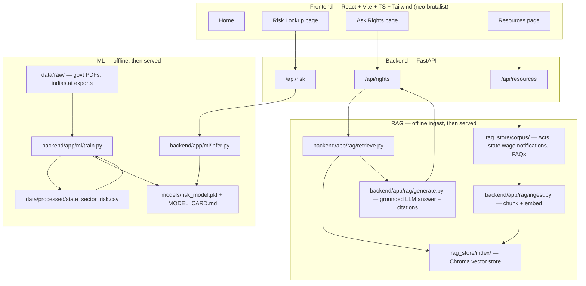

# Architecture

## System overview

## Why two separate pipelines (not one "AI does everything" call)
The risk score and the rights answer are epistemically different kinds of claims:
- The risk score is a **statistical statement** about published government
  irregularity/inspection statistics — it should be produced by an inspectable,
  explainable model you trained, not by an LLM guessing from its training data.
- The rights answer is a **grounded factual statement** about what the law says — it
  must be retrieval-grounded with citations, not generated from parametric memory
  (labour law details, especially state-specific minimum wage rates, are exactly the
  kind of thing LLMs get subtly wrong or out-of-date on).

Keeping these as two distinct, separately-testable components is also the stronger
story for a resume/interview: you can explain each piece's failure modes separately.

## Tech stack detail
| Layer | Choice | Why |
|---|---|---|
| Backend framework | FastAPI | async-friendly, auto OpenAPI docs, Pydantic validation |
| Risk model | scikit-learn / XGBoost | interpretable, fast to train/serve, explainable |
| Embeddings | multilingual sentence-transformers | need Hindi + English retrieval quality |
| Vector store | ChromaDB (local, file-based) | zero infra to stand up for a 1-2 week build |
| LLM for generation | swappable (Gemini / OpenAI / Claude API) | keep this behind one interface so the provider can change without touching retrieval logic |
| Frontend | React + Vite + TypeScript | fast dev loop, strict typing |
| Styling | Tailwind CSS with custom design tokens | matches neo-brutalist system in DESIGN_SYSTEM.md without a heavy component library fighting the aesthetic |

## Data flow for a single "Ask Rights" query
1. User submits query (+ optional state, + language) from `AskRights` page.
2. `POST /api/rights` → `retrieve.py` embeds the query, fetches top-k chunks from
   Chroma filtered by state metadata (if given) and language.
3. `generate.py` builds a prompt that includes ONLY the retrieved chunks as context and
   instructs the LLM to answer solely from them, citing chunk source + section.
4. Response returns `{ answer, citations, disclaimer, language }` — frontend renders
   citations as an expandable list under the answer, disclaimer always visible.

## Known limitations to document (put these in the resume write-up too)
- State-sector risk buckets are only as good as the published irregularity/inspection
  statistics — some states report far more thoroughly than others, which can bias raw
  irregularity counts upward for the *more transparent* states. Document this in the
  model card; it is a genuine, defensible caveat, not a bug to hide.
- Minimum wage notifications go stale — the corpus needs a documented refresh cadence,
  not a "set once" ingest.
